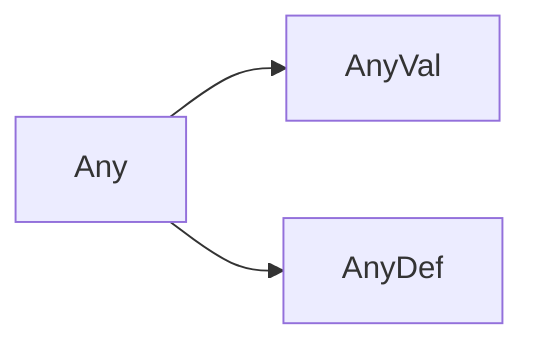

# 简介

语言分类

- 解释型  e.g python
- 编译型  e.g C, C++

C: 可移植性: 相同代码到不同平台, 各自编译


编译器! 编译型，解释型语言的根本区别在哪？

- 是否是强类型, 什么是类型?  => 宽度

Scala on JVM


语言模型

- 面向过程  第一类值: 基本类型 + 指针

- 面向对象  第一类值: 基本类型 + 对象类型

- 函数式     第一类值: 基本类型 + 对象类型 + 函数

Scala 面向对象的函数式语言


Seamless Java Interop

Type Inference

Traits: multiple inheritance

Higher-Order Function: functions are first-class objects


> Version: Spark 2.3.x => Scala 2.11 => jre/jdk 1.8.uxxx


keyword: object

- 在scala中main不能在class里, 必须在object内

```scala
object Hello {
	// Unit: 无返回值/void
  def main(args: Array[String]): Unit = {
    println("hello world")
  }
}
```


scala中, class是必须要被new的, 不存在static class; 

object相当于一个singleton的class和static


在scala中, object名和文件名可以不一致

```scala
object Hello12345 {

  def main(args: Array[String]): Unit = {
    println("hello world")
  }
}
```

在同一个路径下, 不允许存在2个同名的class/object


Scala可以在object类体中写语句

```scala
object Hello {

  println("1");
  println("2");
  def main(args: Array[String]): Unit = {

    println("hello world")
  }
  println("3");
}  
```

这些裸语句相当于在singleton的默认构造器里; Scala编译器做了很多工作, 程序员可以少写代码


```scala
object Hello {

  var xxoo = new xxoo();

  println("1");
  println("2");
  
  def main(args: Array[String]): Unit = {
    xxoo.printMsg()
    println("hello world")
  }
}

class xxoo{
  var a = 3;

  println(s"up....$a...")   //拼接字符串
  
  def printMsg():Unit = {
    println("hello msg.....");
  }
  
  println(s"down....${a + 3}....")  //进行运算
}
```


# Basic

var 普通变量

val 相当于final


Blocks

```
object my{

  println({
    var x = 1 + 1
    x * 2
  })

  def main(args: Array[String]): Unit = {

  }
}

```


Functions

```scala
object my{

  def main(args: Array[String]): Unit = {
    val f =  (x:Int) => x + 1
    println(f(1)) // 2

    val add = (x: Int, y: Int) => { var m = x + y;  m * 10}
    println(add(1, 2)) // 3

    val getTheAnswer = () => 42
    println(getTheAnswer()) // 42
  }
}
```


Method

最后一句话就是返回语句, return可以省略

```scala
def add(i:Int, j: Int) : Int = {
    i + j + 10
  } 
```


Scala Type Hierarchy





在class中裸露代码就是默认构造器中代码, 所以无需关注默认构造器中代码

关注有参构造器

```scala
class xxoo{
  var a = 3;
  
  def this(name: String){
    this()    //需要调默认构造器
  }

  println(s"up....$a...")
  def printMsg():Unit = {
    println(s"hello msg.....${Hello.todo(55)}");
  }
  println(s"down....${a + 3}....")
}
```


类名构造器中的参数就是类的成员属性, 且默认是val, 且是private

```scala
class xxoo(sex:String) {
  var a = 3;

  var name = ""

  def this(n: String){   // 设置了类名构造器后, 个性构造器需要调用
    this(sex)
    name = n;
  }

  println(s"up....$a...")
  def printMsg():Unit = {
    println(s"hello msg.....${Hello.todo(55)}");
    println(this.name)
  }
  println(s"down....${a + 3}....")
}
```

只有类名构造器中的参数可以改成var, 其他方法函数的参数都是val, 无法修改


伴生关系

object类可以被当作工具类使用

如果一个class想访问object中的private成员变量, 就需要让class名和object名一致, 就可以访问object中的private属性


